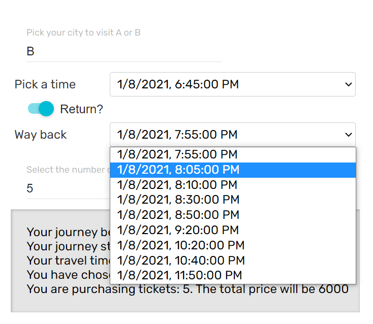
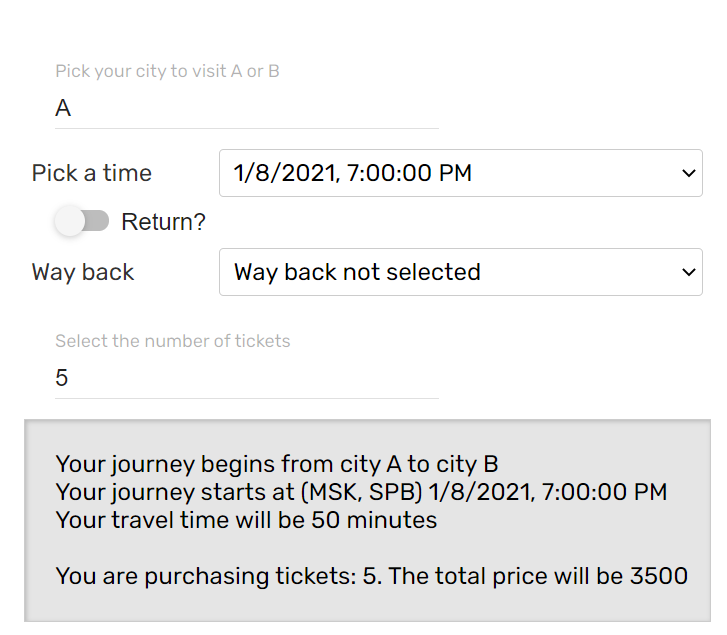

# TASK 2 - React + Redux

Веб версия приложения: [live version](https://react-redux-ticket-shop-git-master-saint-fons.vercel.app/)

## Для запуска
* npm install / yarn install
* npm start / yarn start
* npm build / yarn build
## Использованы технологии; 
#### React, Redux, HTML, JS, CSS, Final-Form, LeafLetJS(API), GeoIpiFy(API), SASS/SCSS, ThunkCreator, Compose, Reselect, Axios, Styled-Components

#### I. Для представления данных из Redux используется компонента ShopContainer
#### II. Во время монтирования ShopContainer вызывается getAddress() и инициирует обращение к API GeoIpiFy
#### III. API GeoIpiFy без указания конкретного IP адреса возвращает информацию по адресу с которого идет запрос. Так мы узнаем, где сейчас пользователь и какой у него часовой пояс 

#### IV. В примере ниже данные при использовании VPN

#### V. Данные из ShopContainer пробрасываются в компоненту Shop, которая возвращает компоненты NewForm(Форма в header), ShopMetaData(Панель с информацией о пользователе), Map(Footer с картой местонахождения пользователя)

#### VI. Форма ввода города назначения имеет валидацию. Только город A или B(Анг.). "Required", если фокус пропал, а города нет.

#### VI. Поле: Pick a Time. Не содержит данных, пока не выбран город A или B. После ввода города время отправления будет разным для A и для B.

#### VII. Поле: Pick a Time. Не содержит данных, пока не выбран город A или B. После ввода города время отправления будет разным для A и для B.

#### VIII. Переключатель: "Return?". Отмечается, если нужен обратный билет. Повлияет на конечную цену билета.
#### IX. Время в пути составляет 50 минут. После выбора потребности в обратном билете, будут предложены даты с лагом в 50 минут

#### X. Поле "Select the number of tickets" - выбор количества билетов. Имеет валидацию; только положительные натуральные числа
#### XI. На сером фоне представлен результат выбора пользователя. Конечная цена будет зависеть от количества выбранных билетов и обратного билета

#### XI. Время в пути одинаково в обе стороны и составит 50 минут. Если был выбран обратный билет, то отобразится полное время в пути

#### XII. Для пользователей из разных стран предусмотрен перевод в текущий часовой пояс. Пример IP адреса для МСК, СПБ

#### XII. Пример для Нью-Йорка. Разница с МСК, СПБ -8 часов

#### XIII. Пример для Амстердама. Разница с МСК, СПБ -2 часа

#### XIII. Пример для Сингапура. Разница с МСК, СПБ + 5 часов

## Структура приложения;
* /src/API содержит файл для обращения к серверу
* /Components/Forms компонента для ввода и отображения данных. Содержит файл стилей формы
* /Components/Map компонента карты. В нее передаются данные о широте и долготе для отображения маркера на карте
* /Redux файл Ticket-reducer содержит редюсер состояния приложения
* /Style/IMG картинки для readme/md
* /Style/style.scss препроцессор глобальных стилей

# TASK 1 - SQL

#### Для новой таблицы;

* discount_ticket_price - цена уцененного билета
* discount_ticket_quantity - количество уцененных билетов
* group_ticket_price - количество уцененных билетов
* group_ticket_quantity - количество уцененных билетов

#### Для новой таблицы;

* ticket_id - айди нового билета
* ticket_format - формат билета (уцененный/групповой/детский)
* ticket_format - дата покупки
* barcode - индивидуальный баркод для каждого билета
* created - дата создания таблицы

